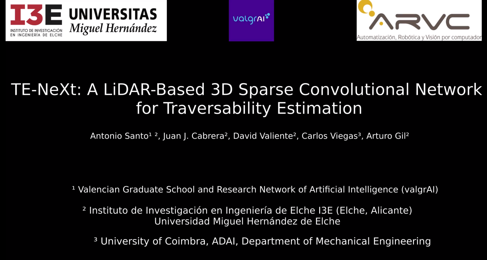

# TE-NeXt: A LiDAR-Based 3D Sparse Convolutional Network for Traversability Estimation
This repository contains the code of the implementation of the article "TE-NeXt: A LiDAR-Based 3D Sparse Convolutional Network for Traversability Estimation". This article develops a novel and efficient architecture focused on traversability estimation, which adopts an encoder-decoder configuration and whose main innovation lies in the convolutional residual block designed, taking into consideration notions of current trends in the world of deep learning, such as vision Transformers and Sparse convolutions. The following image shows the TE-NeXt architecture.

# Examples
### Some inferences in the Rellis-3D dataset

### Some inferences in the SemanticKITTI dataset

### Some inferences in the Semantic-USL dataset

# Video

# Citation

# INSTALLATION

## Requirements
    - Ubuntu >= 14.04
    - CUDA >= 10.1.243 and the same CUDA version used for pytorch (e.g. if you use conda cudatoolkit=11.1, use CUDA=11.1 for MinkowskiEngine compilation)
    - pytorch >= 1.7 You must match the CUDA version pytorch uses and CUDA  version used for Minkowski Engine installation.
    - python >= 3.6
    - ninja (for installation)
    - GCC >= 7.4.0
## Minkowski Engine Installation
### Install GPU compilation
The Minkowski Engine is distributed via PyPI MinkowskiEngine which can be installed simply with pip. First, install pytorch following the instruction. Next, install openblas.

    sudo apt install build-essential      
    python3-dev libopenblas-dev
    pip install torch ninja
    pip install -U MinkowskiEngine --install-option="--blas=openblas" -v --no-deps

For pip installation from the latest source

    pip install -U git+https://github.com/NVIDIA/MinkowskiEngine --no-deps

### Install CPU only compilation
    git clone https://github.com/NVIDIA/MinkowskiEngine.git
    cd MinkowskiEngine
    python setup.py install --cpu_only

## Quick Start
For the correct functioning of the repository the configuration files must be filled in. 
- The **config** folder contains the **.yaml** files that determine which data from each dataset is intended for training or testing and the TE-NeXt training configuration.
- The **model** folder contains the implementation of TE-NeXt

- Afterwards the **dataset.py** file read and prepare the dato for the network. If you wish change the features which we are training the network you should change this script.

- Once the data is ready and its clear the neural network input, the training process is described in training.py.
    - The folders where are located the datasets can be changed in *train.py* or given by arguments.
    - For running the training:
    -     python3 training.py
    - For running the test:
    -     python3 test.py

